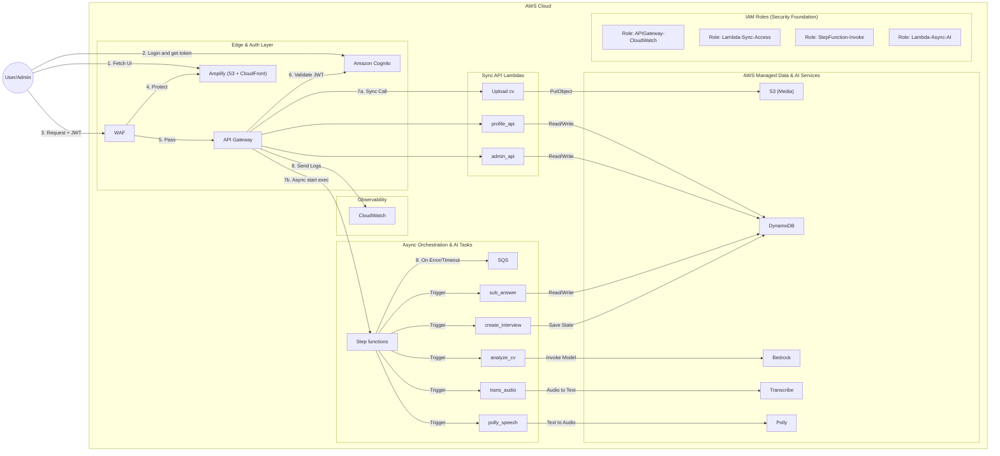

# Vertex-IntervAI / Talent Graph AI Proposal
## An AWS Serverless AI Interview Platform

### 1. Executive Summary

Vertex-IntervAI, also known as Talent Graph AI, is a web application that helps candidates practice interviews using their own CV. Users upload a CV, the system stores it securely, analyzes its content with AI, creates interview questions based on the CV and selected role, accepts text or voice answers, scores each answer, and returns results with scores, feedback, and improvement advice.

The project uses a React + Vite frontend and an AWS Serverless backend. The backend is built with API Gateway, AWS Lambda, Amazon S3, Amazon DynamoDB, Amazon Cognito, Amazon Bedrock, Amazon Polly, Amazon Transcribe, Amazon CloudWatch, and Amazon SES for future feedback email.

The current project already has the main user flow: Cognito login, dashboard, CV upload, CV analysis, interview role selection, question count selection, AI interview, answer scoring, results, history, profile, settings, language and interface switching, and an admin console. The remaining work includes real JWT authentication, IAM/CORS verification, full voice-flow testing, cross-device history synchronization, and production deployment.

### 2. Problem Statement

Many students and early-career candidates prepare for interviews using generic question lists, so their practice is often not aligned with their CV, skills, projects, experience, or actual target position. Manual mock interviews are also time-consuming and difficult to repeat many times.

Vertex-IntervAI solves this by turning a CV into an interview preparation flow:

- Analyze the CV to extract skills, experience, education, projects, and suitable role suggestions.
- Let candidates select an AI role such as software engineer, data analyst, AI engineer, cloud engineer, or a role suggested from the CV.
- Generate a configurable number of questions, with a default of 5 and a minimum of 2.
- Support both text and voice answers.
- Score each answer and provide comments and improvement suggestions.
- Store interview history for later review.
- Provide an admin console to manage users, CVs, interviews, the review queue, audit logs, CSV exports, and feedback email workflows.

### 3. Project Objectives

The project aims to build a practical AI interview practice system with the following objectives:

- Build a complete web application for CV upload, AI interview practice, results, history, and profile management.
- Apply an AWS Serverless architecture to reduce infrastructure administration and support flexible scaling.
- Use Amazon Bedrock to analyze CVs, generate interview questions, and evaluate answers.
- Support voice interview practice with Amazon Polly and Amazon Transcribe.
- Store user information, CV metadata, interview sessions, and results in a clear data structure.
- Provide an admin page for monitoring and managing operational data.
- Build a step-by-step AWS deployment workshop.

### 4. Solution Architecture

### 5. AWS Services Used

- **Amazon Cognito** handles registration, login, Hosted UI, JWT authentication, and user/admin authorization.
- **Amazon DynamoDB** stores users, CV metadata, interview sessions, answers, scores, and history.
- **Amazon S3** stores CV files, question audio, answer audio, and transcripts.
- **AWS Lambda** runs the backend for CV upload and analysis, profiles, interview creation, scoring, voice, history, and administration.
- **Amazon API Gateway** provides REST APIs, CORS configuration, and JWT-authorized routes.
- **Amazon Bedrock** analyzes CVs, creates interview questions, evaluates answers, and provides improvement suggestions.
- **Amazon Polly** converts interview questions into audio.
- **Amazon Transcribe** converts voice answers into text.
- **Amazon CloudWatch Logs** stores logs and supports Lambda/API Gateway debugging.
- **AWS Amplify Hosting** builds and deploys the React + Vite frontend.

### 6. Technical Implementation

The workshop is divided into stages for deploying and configuring the services:

1. Prepare the AWS Region, budget alerts, source code, and environment variables.
2. Create the Cognito User Pool, App Client, Hosted UI domain, callback URL, logout URL, and `user`/`admin` groups.
3. Create S3 buckets for CVs and audio, then configure CORS and IAM permissions.
4. Create the `Users`, `CVs`, and `Interviews` DynamoDB tables.
5. Deploy Lambda functions for CVs, profiles, history, interviews, voice, and administration.
6. Create API Gateway routes, connect Lambda integrations, and configure CORS and JWT authorization.
7. Enable access to Amazon Bedrock models and connect the relevant AI Lambdas.
8. Configure Amazon Polly and Amazon Transcribe for voice features.
9. Configure the frontend `.env` variables and deploy React + Vite with Amplify Hosting.
10. Test user flows, admin flows, voice, results, and history.
11. Clean up resources after the workshop to avoid unnecessary charges.

#### Current Status

| Item | Status |
| --- | --- |
| CV upload to S3 | Implemented |
| CV metadata in DynamoDB | Implemented |
| CV analysis with Bedrock/fallback | Implemented |
| Profile GET/POST | Implemented |
| Interview question generation | Implemented |
| Answer scoring | Implemented |
| Answer scoring | Completed |

### 7. Timeline and Milestones

- **Phase 1 - Project initiation and architecture design**: Analyze requirements, create the React project, build the basic routing and layout, design the DynamoDB schema, prepare S3 CV storage, define the AI workflow, and create the AWS architecture checklist.
- **Phase 2 - Login, CV upload, and storage**: Complete the login UI, integrate the Cognito Hosted UI, build drag-and-drop CV upload, write the `upload_cv` Lambda, store files in S3, store metadata in DynamoDB, and configure callback/logout URLs.
- **Phase 3 - CV analysis and dashboard**: Complete the dashboard, write the `analyze_cv` Lambda, read CVs from S3, analyze them with Bedrock/Nova Lite, store skills/projects/experience/certificates, and protect APIs with the Cognito JWT authorizer.
- **Phase 4 - AI interview and answer scoring**: Build the AI Interview interface, create interview sessions, generate questions based on the CV and role, store answers, score them, return feedback, suggest better answers, and calculate the total score.
- **Phase 5 - Voice, history, profile, settings, and administration**: Build the History, Profile, and Settings pages, write `history_api` and `profile_api`, integrate Polly/Transcribe for voice, build the Admin Console, export CSV data, and prepare the feedback email workflow.
- **Phase 6 - Testing, deployment, documentation, and demo**: Polish the UI, test responsiveness, verify API Gateway/Lambda/DynamoDB/IAM/CORS, improve prompts and scoring, compile the deployment guide, capture screenshots, complete the worklog, and prepare the demo checklist.

### 8. Budget Estimation

The project is designed for a student/demo workload, so the first version should remain low cost when traffic is small. Main cost drivers are Bedrock inference, Transcribe minutes, Polly characters, S3 storage, DynamoDB read/write capacity, API Gateway requests, and Lambda invocations.

Expected cost profile:

- **Low traffic demo**: mostly free-tier or very low monthly cost, except Bedrock/voice usage.
- **Active testing**: cost increases with generated questions, answer scoring, audio generation, and transcription minutes.
- **Production**: add CloudFront, WAF, monitoring, backups, and SES production email after account verification.

Cost controls:

- Limit question count by default.
- Store only required audio/transcript files.
- Use DynamoDB on-demand capacity for unpredictable student/demo traffic.
- Add AWS Budgets alerts.
- Keep CloudWatch log retention reasonable.

### 9. Risk Assessment

| Risk | Impact | Mitigation |
| --- | --- | --- |
| Cognito callback/logout mismatch | Users cannot log in | Keep localhost and deployed URLs synchronized in Cognito and frontend `.env` |
| Missing CORS settings | Frontend cannot call APIs | Validate each route with browser DevTools and API Gateway CORS settings |
| Weak IAM permissions | Lambda fails or has too much access | Use least-privilege IAM policies per function |
| Bedrock model unavailable | Analysis or scoring fails | Keep fallback analysis/scoring path and clear error handling |
| Polly voice mismatch for Vietnamese | Vietnamese audio quality is poor | Use language-specific voice selection and browser speech fallback where needed |
| Transcribe language mismatch | Voice answers transcribe incorrectly | Pass language code based on selected UI language |
| SES sandbox | Feedback email only sends to verified recipients | Request SES production access before production email features |
| CloudFront/WAF account limitation | Static hosting production path delayed | Use local/Vite or S3 website deployment until account verification is complete |

### 10. Expected Outcomes

After completion, Vertex-IntervAI will provide a complete AI interview practice process: users can log in, upload a CV, receive AI analysis, practice interviews, answer by text or voice, view scores and feedback, and review their practice history. The workshop will also produce reusable documentation for deploying similar systems on AWS Serverless.